# DiplomaWork
Diploma work
# 📌 Aplikacja do planowania posiłków

Aplikacja internetowa umożliwiająca użytkownikom planowanie posiłków oraz automatyczne generowanie listy zakupów na podstawie wybranych przepisów. Powstała w ramach pracy dyplomowej na Uniwersytecie Zielonogórskim.

## ✨ Kluczowe funkcjonalności

✅ Rejestracja i logowanie użytkowników 🔐  
✅ Przeglądanie przepisów 🍲  
✅ Dodawanie przepisów do planu posiłków 📅  
✅ Automatyczne generowanie listy zakupów 🛒  
✅ Eksport listy zakupów do pliku PDF 📄  
✅ Intuicyjna obsługa metodą „przeciągnij i upuść” 🎯  
✅ Responsywny interfejs dostosowany do urządzeń mobilnych 📱  

## 🛠️ Wykorzystane technologie

### Frontend

### Backend

### Testowanie

## 📖 Jak korzystać?

1. **Zarejestruj się lub zaloguj** 📝
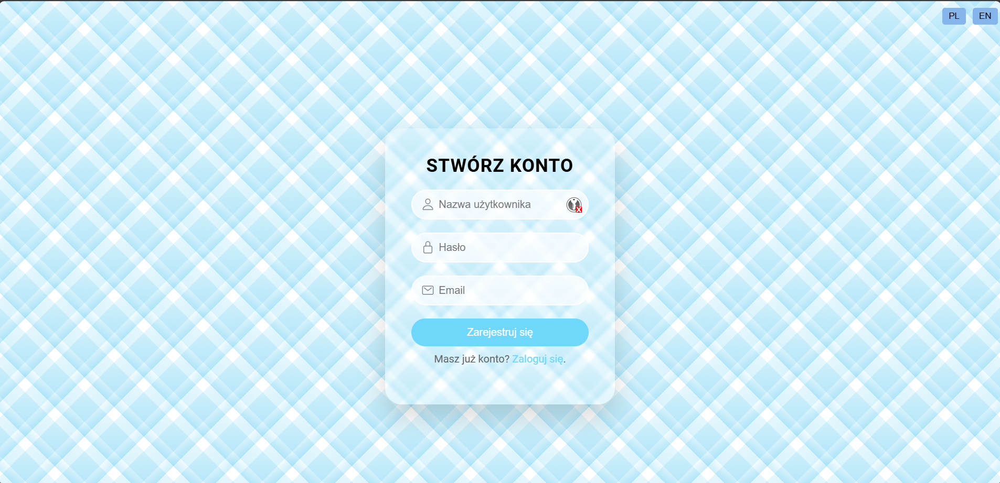
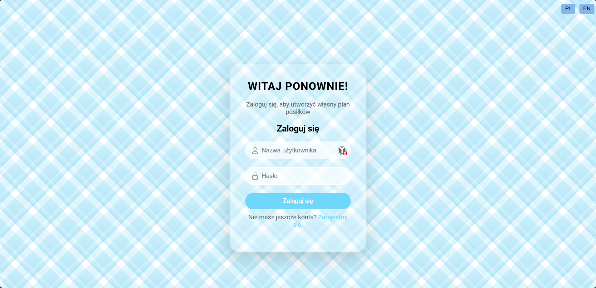
2. **Dodaj przepisy do swojego planu posiłków poprzez funkcjonalność przeciągnij i upuść lub stwórz nowy przepis** 📅
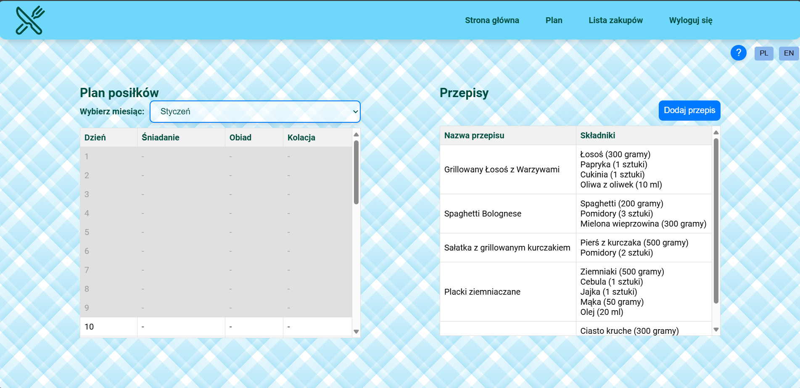
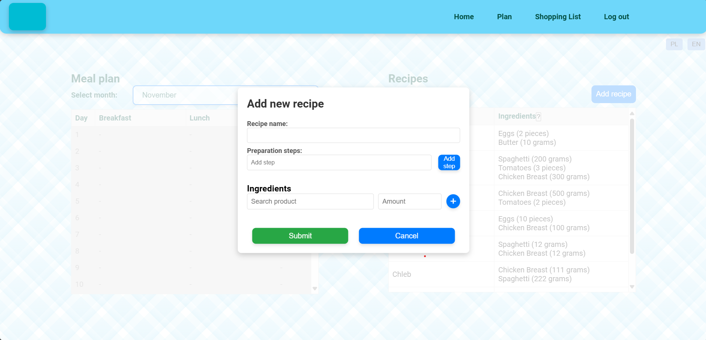
3. **Przeglądaj plan i szczegóły przepisu** 🛍️
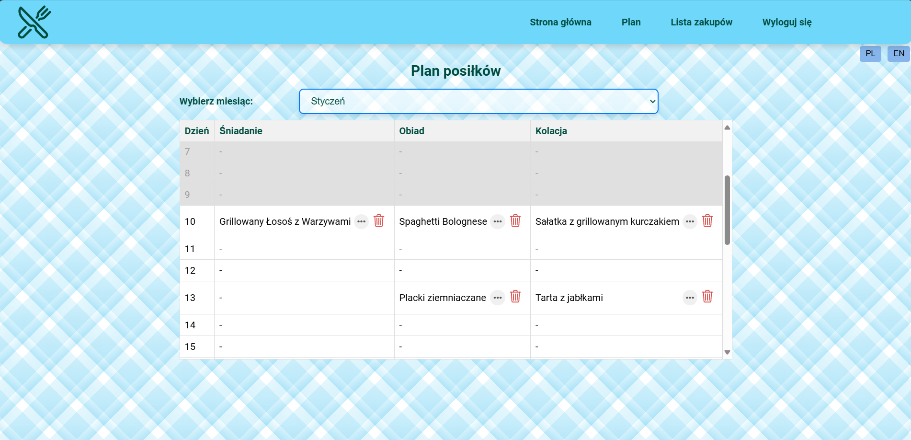
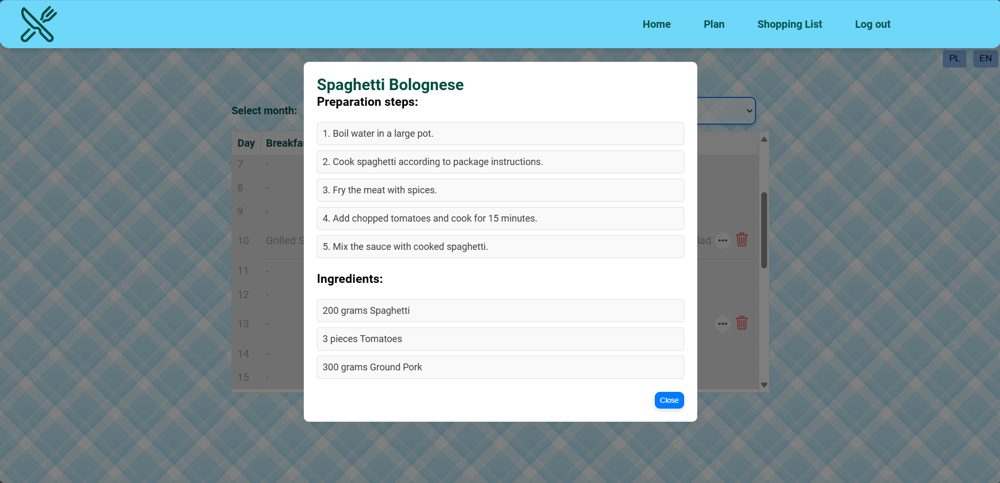
4. **Przeglądaj liste zakupów lub pobierz listę w formacie PDF** 📄
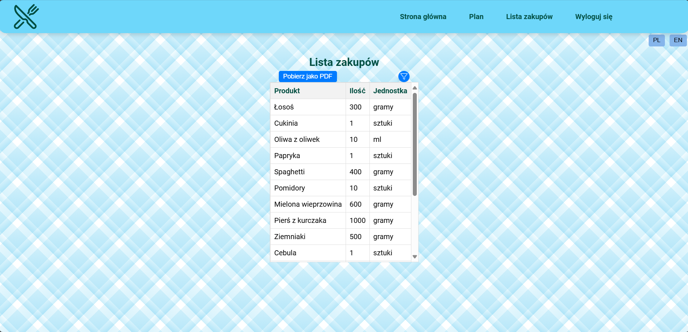
5. **Ciesz się lepszą organizacją posiłków!** 🎉

## UI na urządzeniach mobilnych

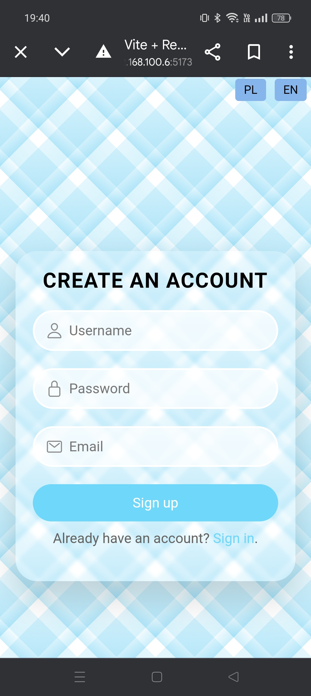
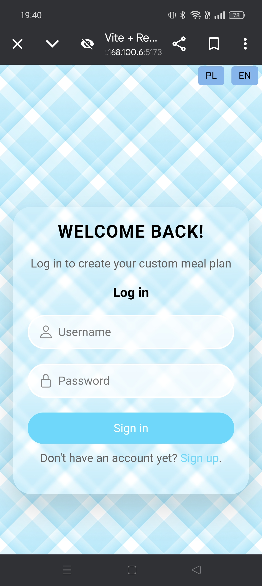
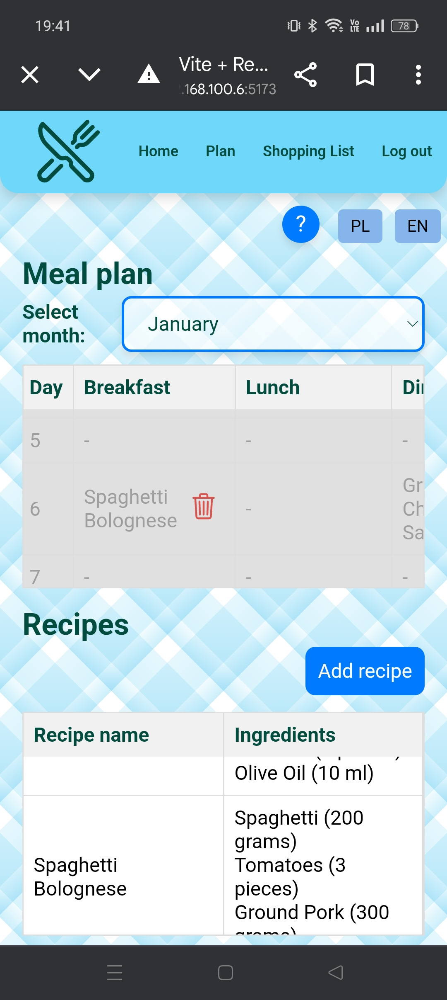
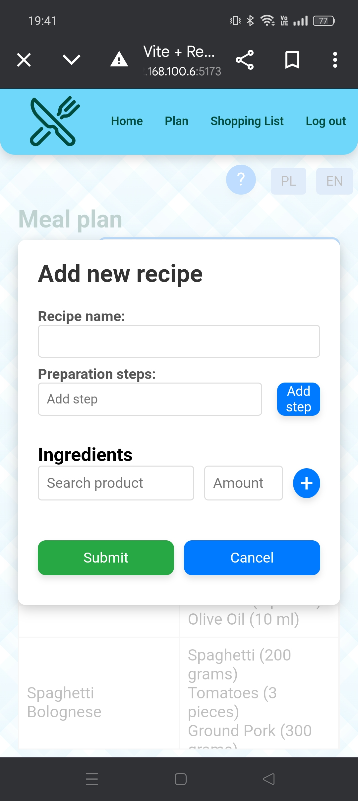
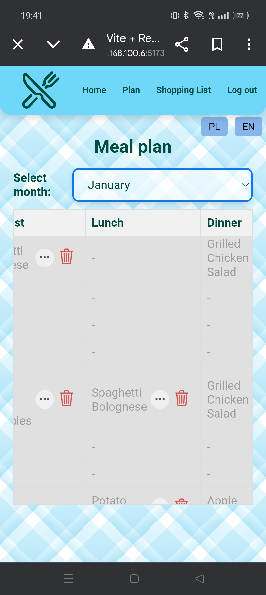
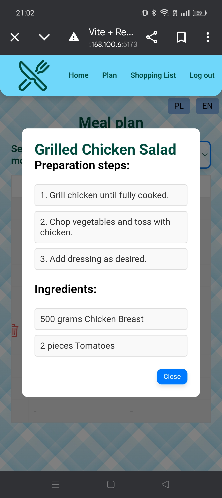
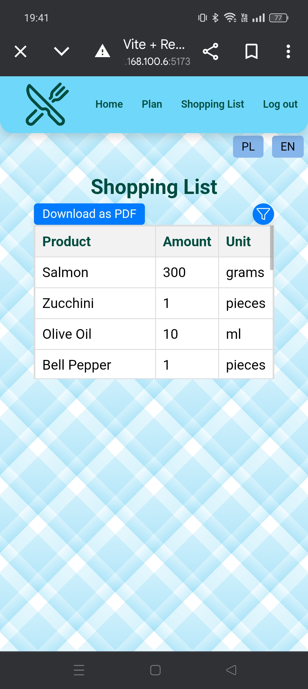

🛠 Stworzone przez Michała Hoffmana w ramach pracy dyplomowej na Uniwersytecie Zielonogórskim.

